# 部署任务流程设计文档

## 📋 文档概述

本文档详细描述了 Boreas 持续部署平台的部署任务流程设计，包括核心概念、数据模型、执行流程和前端展示。

**最后更新**: 2025-10-26

---

## 🎯 核心概念

### 1. 部署任务 (Deployment)

部署任务是平台的核心执行单元，每个版本(Version)在特定环境(Environment)中的部署会创建一个部署任务。

**关键特性**:
- 一个版本可以对应多个部署任务（不同环境）
- 包含多个应用(Application)的部署操作
- 支持部署编排（顺序、批次、灰度）
- 支持人工确认和自动回滚

### 2. 任务 (Task)

Task 是 Deployment 的子单元，表示对单个应用的具体操作。

**任务类型**:
- `build`: 构建镜像/制品
- `test`: 执行测试
- `deploy`: 部署应用
- `health_check`: 健康检查

### 3. 步骤 (Step)

前端工作流展示的抽象概念，将多个 Task 组织成可视化的执行流程。

---

## 📊 数据模型

### 后端模型 (Go)

#### Deployment 模型

```go
type Deployment struct {
    ID            string           // 部署任务唯一标识
    VersionID     string           // 关联的版本ID
    MustInOrder   datatypes.JSON   // 应用部署顺序 []string
    EnvironmentID string           // 目标环境ID
    Status        DeploymentStatus // 部署状态
    CreatedBy     string           // 创建人
    CreatedAt     time.Time        // 创建时间
    UpdatedAt     time.Time        // 更新时间
    StartedAt     *time.Time       // 开始时间
    CompletedAt   *time.Time       // 完成时间
    ErrorMessage  string           // 错误信息
    
    ManualApproval bool           // 是否需要人工审批
    Strategy       datatypes.JSON // 部署策略 []DeploySteps
    
    // 关联
    Version     Version
    Environment Environment
    Tasks       []Task
}

type DeploymentStatus string
const (
    DeploymentStatusPending    = "pending"      // 等待执行
    DeploymentStatusRunning    = "running"      // 执行中
    DeploymentStatusSuccess    = "success"      // 成功
    DeploymentStatusFailed     = "failed"       // 失败
    DeploymentStatusRolledBack = "rolled_back"  // 已回滚
    DeploymentStatusCancelled  = "cancelled"    // 已取消
)
```

#### Task 模型

```go
type Task struct {
    ID           string     // 任务唯一标识
    DeploymentID string     // 所属部署任务ID
    AppID        string     // 关联的应用ID
    Type         string     // 任务类型
    Status       TaskStatus // 任务状态
    BlockBy      string     // 阻塞依赖
    Payload      string     // 任务负载数据
    Result       string     // 执行结果
    CreatedAt    time.Time
    UpdatedAt    time.Time
    StartedAt    *time.Time
    CompletedAt  *time.Time
    
    // 关联
    Deployment  Deployment
    Application Application
}

type TaskStatus string
const (
    TaskStatusPending    = "pending"      // 等待执行
    TaskStatusRunning    = "running"      // 执行中
    TaskStatusSuccess    = "success"      // 成功
    TaskStatusFailed     = "failed"       // 失败
    TaskStatusBlocked    = "blocked"      // 被阻塞
    TaskStatusCancelled  = "cancelled"    // 已取消
    TaskStatusRolledBack = "rolled_back"  // 已回滚
)
```

#### DeploySteps 策略

```go
type DeploySteps struct {
    BatchSize            int     // 批次大小
    BatchInterval        int     // 批次间隔（秒）
    CanaryRatio          float64 // 金丝雀比例
    AutoRollback         bool    // 自动回滚
    ManualApprovalStatus *bool   // 人工审批状态
}
```

### 前端模型 (TypeScript)

#### Deployment 接口

```typescript
export interface Deployment {
  id: string
  versionId: string
  version: string
  applicationIds: string[]
  applications: string[]
  environmentIds: string[]
  environments: string[]
  status: 'pending' | 'running' | 'success' | 'failed' | 'waiting_confirm'
  progress: number
  createdAt: string
  updatedAt: string
  duration?: number
  requireConfirm: boolean
  grayscaleEnabled: boolean
  grayscaleRatio?: number
}

export interface DeploymentDetail extends Deployment {
  steps: DeploymentStep[]
  logs: DeploymentLog[]
}
```

#### DeploymentStep 接口

```typescript
export interface DeploymentStep {
  id: string
  name: string
  status: 'pending' | 'running' | 'success' | 'failed'
  duration?: number
  logs?: string[]
}
```

**注意**: 前端的 `status` 比后端简化，`waiting_confirm` 是部署级别的状态，不是步骤状态。

---

## 🔄 执行流程

### 1. 部署任务创建流程

```mermaid
sequenceDiagram
    participant User as 用户/Git
    participant Master as Master 服务
    participant DB as 数据库
    participant Operator as Operator

    User->>Master: 创建部署请求
    Master->>Master: 验证版本和环境
    Master->>Master: 解析应用列表
    Master->>Master: 生成部署策略
    Master->>DB: 创建 Deployment 记录
    Master->>DB: 创建 Task 记录
    Master-->>User: 返回部署任务ID
    
    opt 自动开始
        Master->>Master: 启动部署执行器
        Master->>Operator: 发送部署指令
    end
```



### 2. 部署任务执行流程

```mermaid
stateDiagram-v2
    [*] --> Pending: 创建部署任务
    Pending --> Running: 开始执行
    
    Running --> WaitingConfirm: 需要人工确认
    WaitingConfirm --> Running: 确认继续
    WaitingConfirm --> RolledBack: 选择回滚
    
    Running --> Success: 所有任务成功
    Running --> Failed: 任务失败
    
    Failed --> RolledBack: 自动/手动回滚
    
    Success --> [*]
    Failed --> [*]
    RolledBack --> [*]
    Running --> Cancelled: 取消部署
    Cancelled --> [*]
```



### 3. Task 执行顺序

部署任务中的 Task 按照以下规则执行:

1. **顺序约束**: `MustInOrder` 字段定义应用部署顺序
2. **类型顺序**: 同一应用内，Task 按类型顺序执行
   - build → test → deploy → health_check
3. **阻塞依赖**: `BlockBy` 字段定义任务间依赖关系
4. **并行执行**: 无依赖的任务可并行执行

**示例**:
```json
{
  "MustInOrder": ["user-service", "order-service", "payment-service"],
  "Tasks": [
    {"AppID": "user-service", "Type": "build"},
    {"AppID": "user-service", "Type": "deploy", "BlockBy": "user-service-build"},
    {"AppID": "order-service", "Type": "deploy", "BlockBy": "user-service-deploy"},
    {"AppID": "payment-service", "Type": "deploy", "BlockBy": "order-service-deploy"}
  ]
}
```

### 4. 部署策略执行

支持多种部署策略:

#### 蓝绿部署
```json
{
  "Strategy": [
    {
      "BatchSize": 0,
      "CanaryRatio": 0,
      "AutoRollback": true
    }
  ]
}
```

#### 金丝雀部署
```json
{
  "Strategy": [
    {
      "BatchSize": 1,
      "BatchInterval": 300,
      "CanaryRatio": 0.1,
      "AutoRollback": true,
      "ManualApprovalStatus": null
    },
    {
      "BatchSize": 0,
      "CanaryRatio": 1.0,
      "AutoRollback": false
    }
  ]
}
```

#### 滚动更新
```json
{
  "Strategy": [
    {
      "BatchSize": 3,
      "BatchInterval": 60,
      "CanaryRatio": 0,
      "AutoRollback": true
    }
  ]
}
```

---

## 🎨 前端工作流展示

### 当前实现 (v1.0)

前端使用 **React Flow** 实现 DAG 工作流可视化。

#### 组件架构

```
DeploymentDetail (页面)
  └── WorkflowViewer (工作流查看器)
        ├── WorkflowNode (自定义节点)
        └── ReactFlow (图表引擎)
```

#### 步骤映射策略

**问题**: 后端的 Task 是细粒度的（每个应用每个类型一个 Task），前端需要更高层次的步骤展示。

**当前方案**: 使用 Mock 数据中预定义的 `steps` 数组

**示例**:
```typescript
// 后端可能有 20+ 个 Task
// 前端展示为 4 个高层步骤
steps: [
  { id: '1', name: '准备部署', status: 'success' },
  { id: '2', name: '拉取镜像', status: 'success' },
  { id: '3', name: '更新服务', status: 'running' },
  { id: '4', name: '健康检查', status: 'pending' }
]
```

#### 编辑功能

支持编辑模式（仅 `pending` 和 `waiting_confirm` 状态）:

- ✅ 拖拽节点位置
- ✅ 上移/下移调整顺序
- ✅ 创建/删除连接线
- ✅ 添加新步骤
- ✅ 删除步骤（Delete/Backspace）

---

## 🔧 待优化事项

### 1. 步骤生成逻辑

**当前问题**: 前端 steps 是硬编码的 mock 数据

**建议方案**:

#### 方案A: 后端聚合生成
```go
// 在 Deployment Service 中
func (s *Service) GetDeploymentSteps(deploymentID string) []DeploymentStep {
    tasks := s.taskRepo.GetByDeploymentID(deploymentID)
    
    // 按照类型和应用分组聚合
    steps := []DeploymentStep{
        {Name: "准备部署", TaskIDs: [...], Status: "success"},
        {Name: "构建镜像", TaskIDs: [...], Status: "running"},
        // ...
    }
    
    return steps
}
```

#### 方案B: 前端动态聚合
```typescript
function aggregateTasks(tasks: Task[]): DeploymentStep[] {
  // 按类型分组
  const grouped = groupBy(tasks, 'type')
  
  return [
    {
      id: 'prepare',
      name: '准备部署',
      status: getGroupStatus(grouped['build']),
    },
    // ...
  ]
}
```

**推荐**: 方案A，后端提供聚合后的步骤，减少前端复杂度。

### 2. 实时状态更新

**当前**: 前端每 3 秒轮询

**建议**: 实现 WebSocket 推送

```go
// 伪代码
func (s *Service) ExecuteDeployment(deploymentID string) {
    for _, task := range deployment.Tasks {
        s.executeTask(task)
        
        // 推送状态更新
        s.wsHub.Broadcast(deploymentID, StatusUpdate{
            TaskID: task.ID,
            Status: task.Status,
        })
    }
}
```

### 3. 步骤依赖关系

**当前**: 前端步骤是线性顺序（A → B → C → D）

**建议**: 支持复杂 DAG（有向无环图）

```typescript
interface DeploymentStep {
  id: string
  name: string
  status: string
  dependencies: string[]  // 依赖的步骤ID
  parallel: boolean        // 是否可并行
}

// 示例：并行构建多个应用
steps: [
  { id: '1', name: '准备', dependencies: [] },
  { id: '2a', name: '构建服务A', dependencies: ['1'], parallel: true },
  { id: '2b', name: '构建服务B', dependencies: ['1'], parallel: true },
  { id: '3', name: '部署', dependencies: ['2a', '2b'] }
]
```

### 4. 步骤日志关联

**当前**: `DeploymentStep` 包含 `logs` 字段，但未实现详细展示

**建议**: 点击步骤展开日志面板

```typescript
interface DeploymentStep {
  id: string
  name: string
  status: string
  logs: StepLog[]
  tasks: Task[]  // 关联的具体任务
}

interface StepLog {
  timestamp: string
  level: 'info' | 'warn' | 'error'
  message: string
  taskId?: string  // 来源任务
}
```

### 5. 人工确认流程

**当前**: `waiting_confirm` 状态时显示确认按钮

**建议**: 支持步骤级别的确认

```typescript
interface DeploymentStep {
  id: string
  name: string
  status: 'pending' | 'running' | 'waiting_confirm' | 'success' | 'failed'
  requireConfirm: boolean
  confirmedBy?: string
  confirmedAt?: string
}
```

**UI 改进**:
- 在需要确认的步骤上显示"等待确认"徽章
- 点击步骤弹出确认对话框
- 记录确认人和确认时间

---

## 📝 API 设计建议

### 获取部署详情（含步骤）

```http
GET /api/v1/deployments/:id

Response:
{
  "id": "deploy-001",
  "version": "v1.2.5",
  "status": "running",
  "steps": [
    {
      "id": "step-1",
      "name": "准备部署",
      "type": "prepare",
      "status": "success",
      "startedAt": "2024-10-21T14:00:00Z",
      "completedAt": "2024-10-21T14:05:00Z",
      "duration": 300,
      "tasks": ["task-1", "task-2"],
      "logs": [...]
    },
    {
      "id": "step-2",
      "name": "构建镜像",
      "type": "build",
      "status": "running",
      "startedAt": "2024-10-21T14:05:00Z",
      "tasks": ["task-3", "task-4", "task-5"],
      "logs": [...]
    }
  ]
}
```

### 更新工作流编排

```http
PUT /api/v1/deployments/:id/workflow

Request:
{
  "steps": [
    {
      "id": "step-1",
      "name": "准备部署",
      "order": 1,
      "dependencies": []
    },
    {
      "id": "step-2",
      "name": "构建镜像",
      "order": 2,
      "dependencies": ["step-1"]
    }
  ]
}

Response:
{
  "success": true,
  "message": "工作流已更新"
}
```

### 获取步骤日志

```http
GET /api/v1/deployments/:id/steps/:stepId/logs

Response:
{
  "stepId": "step-2",
  "logs": [
    {
      "timestamp": "2024-10-21T14:05:00Z",
      "level": "info",
      "message": "开始构建 user-service",
      "taskId": "task-3"
    },
    {
      "timestamp": "2024-10-21T14:05:30Z",
      "level": "info",
      "message": "镜像构建成功: user-service:v1.2.5",
      "taskId": "task-3"
    }
  ]
}
```

---

## 🎯 下一步行动项

### 短期（本周）
- [ ] 明确 Step 和 Task 的映射关系
- [ ] 确定步骤聚合逻辑（后端 vs 前端）
- [ ] 设计步骤日志展示 UI

### 中期（本月）
- [ ] 实现后端步骤聚合 API
- [ ] 支持 DAG 复杂依赖关系
- [ ] 添加 WebSocket 实时推送

### 长期（下季度）
- [ ] 支持自定义工作流模板
- [ ] 实现工作流版本控制
- [ ] 添加工作流可视化编排器（拖拽设计）

---

## 📚 参考资料

- [GitOps 最佳实践](https://www.weave.works/blog/what-is-gitops-really)
- [Argo CD Workflow](https://argoproj.github.io/argo-workflows/)
- [React Flow 文档](https://reactflow.dev/)
- [Kubernetes Deployment Strategies](https://kubernetes.io/docs/concepts/workloads/controllers/deployment/)

---

**文档维护**: 该文档会随着系统演进持续更新。如有疑问或建议，请联系开发团队。

