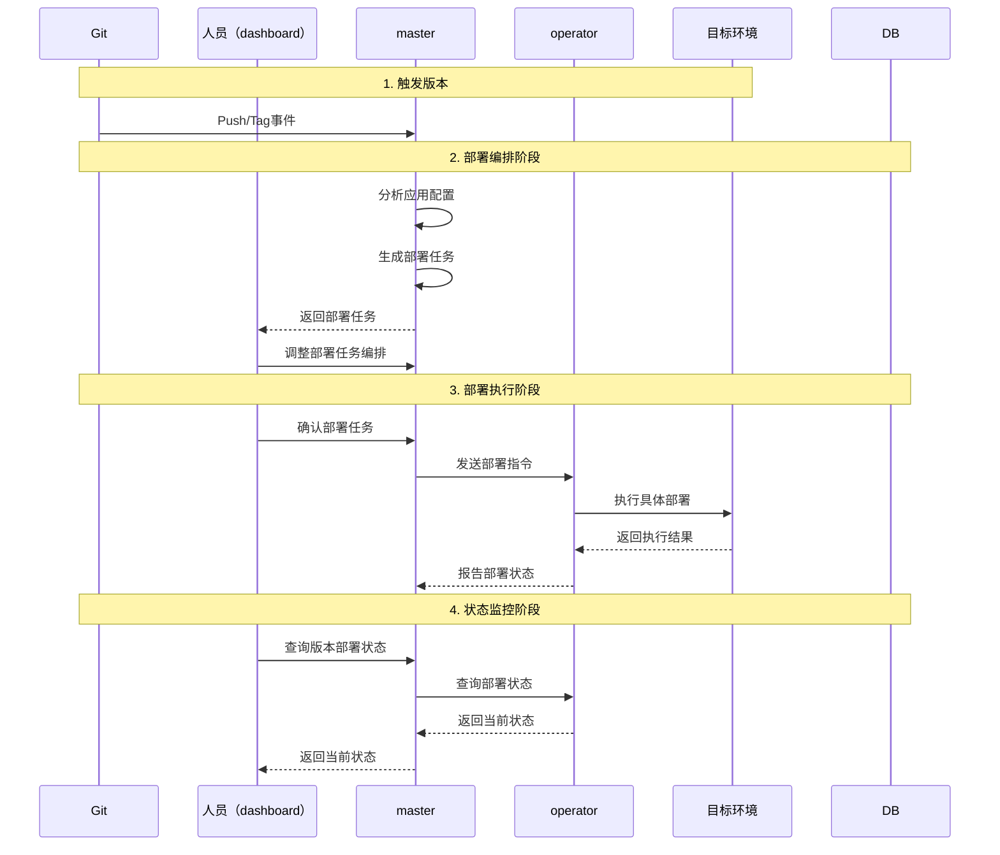
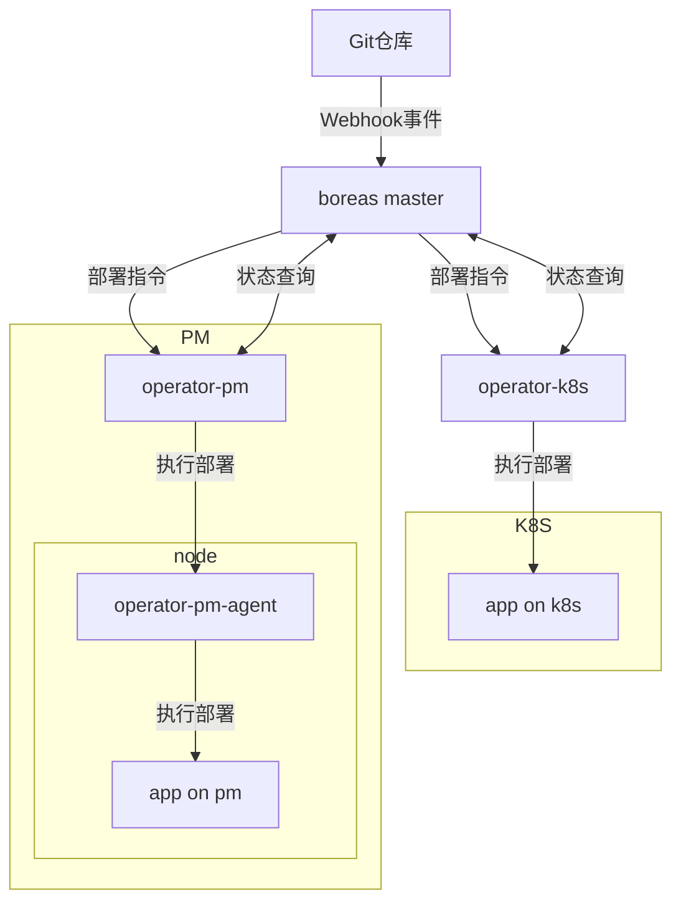

# Boreas - 持续部署平台

Boreas 是一个的持续部署平台。基于GitOps最佳实践，提供完整的版本管理、应用管理和部署编排功能，同时支持部署至物理机（PM）、kubernetes（K8S）等多种运行环境。

## 特点

- GitOps
  - 持续对于应用保持高频、及时更新，保持快速迭代
  - 自动触发和分析，保留任务更新上下文
  - 全面的状态跟踪，保持代码与部署的一致性
- 部署编排
  - 更新顺序、操作节奏
  - 并行灰度发布
- 声明式对象配置
- 支持多重部署环境

## 核心概念

### 版本（version）

本身是一个字符串，即版本号。向前对应到代码仓库的具体位置（git commit、tag等）；向后是保持跟踪同步的核心标识。

- 版本有新旧逻辑，且新版本包含旧版本。
- 版本有状态。normal（正常，默认状态）、revert（回滚）

### 应用（app）

部署任务中的最小单元，也是业务在部署平台中的抽象。

### 部署任务（deployment）

每个版本会对应一个部署任务，部署任务包含了对于一系列应用（app）的部署相关操作（task），且按照编排顺序执行。

## 架构概述

- `master`
  平台核心组件
  - 入口网关。与Git交互，分析应用配置，触发部署流程。
  - 控制模块。编排部署任务，执行部署任务流程。
  - 监控模块。保存版本记录，保持对于版本部署结果的同步、监控和跟踪。
- `dashborad`
  `master`的web界面
- operator-k8s
  针对于kubernetes（K8S）环境的部署执行组件。
  - 执行`master`下发的操作指令，去更新操作kubernetes（K8S）中的应用。
  - 给`master`返回K8S中的应用状态
- operator-pm
  针对于物理机（PM）环境的部署执行组件。
  - 执行`master`下发的操作指令，在下发到具体的`operator-pm-agent`去执行操作。
  - 汇总`operator-pm-agent`返回的信息，再统一返回给`master`应用状态。
- operator-pm-agent
  在各物理机（PM）节点上的代理组件。执行本机器上的具体操作。

## 业务流程

### 交互流程

### 调用流程

